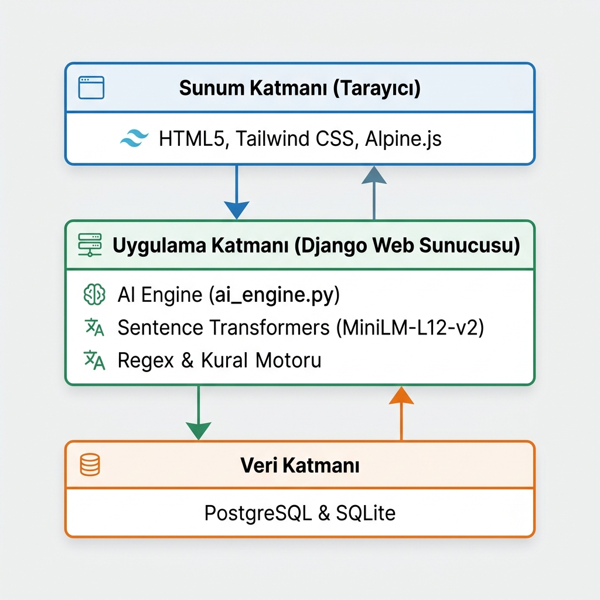
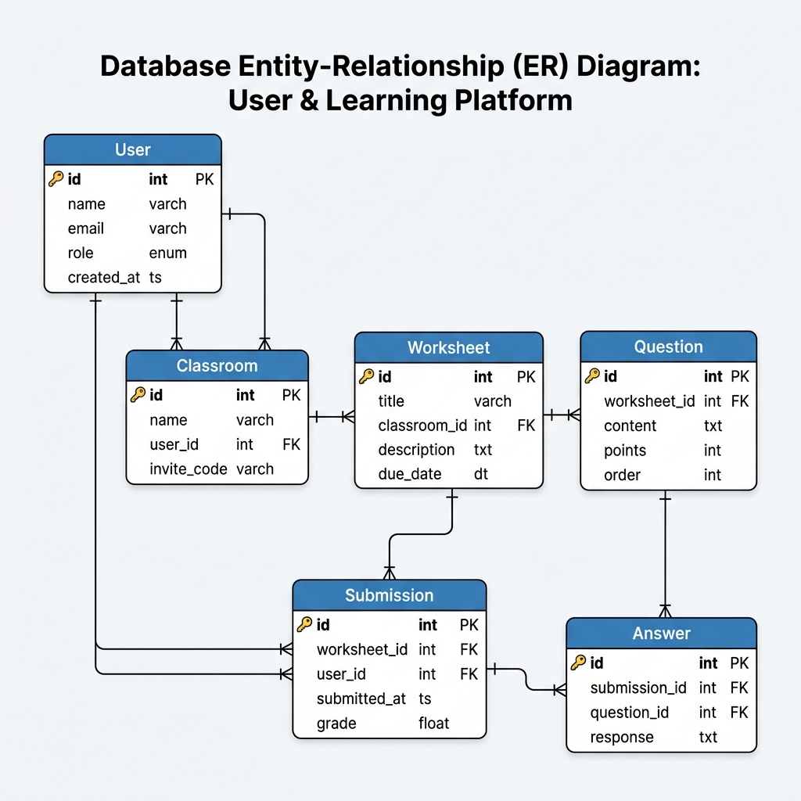
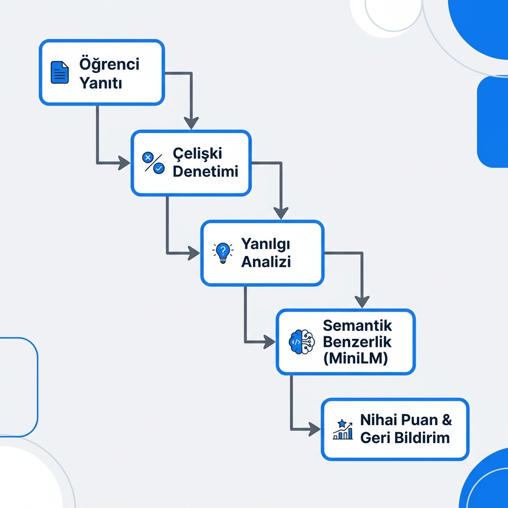
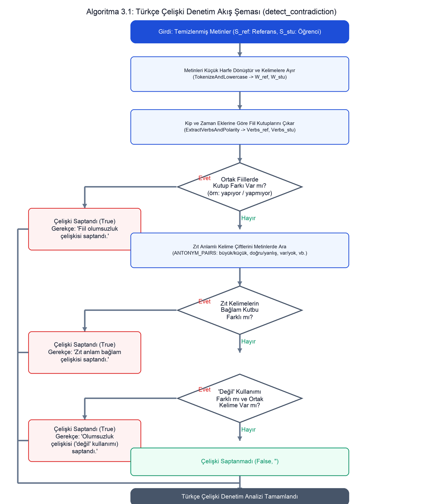
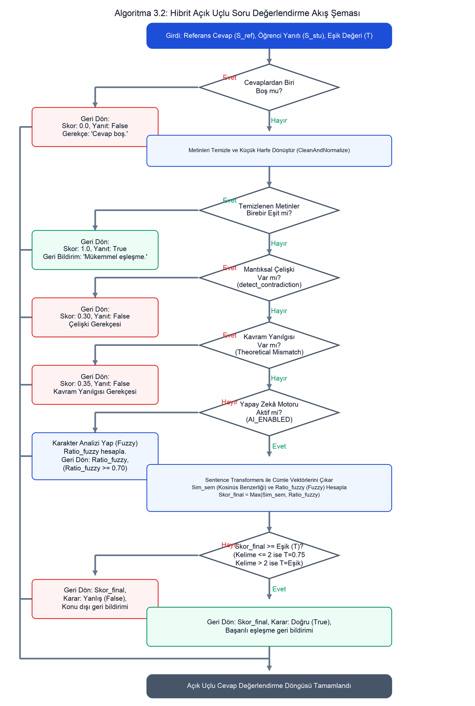

# 3. METOD VE MATERYAL

Bu bölümde; geliştirilen "Yapay Zekâ Destekli Etkileşimli Çalışma Kağıdı ve Değerlendirme Platformu"nun geliştirilmesinde kullanılan teknolojiler, sistem gereksinimleri, genel yazılım mimarisi, ilişkisel veritabanı tasarımı, kullanıcı rolleri ve akış şemaları sunulmaktadır. Ayrıca, platformun çekirdek bileşeni olan yapay zekâ değerlendirme motorunun ve kazanım bazlı öneri algoritmalarının matematiksel, dil bilimsel ve yapısal kurguları ile algoritmik tasarımları sunulmaktadır.

## 3.1. Kullanılan Teknolojiler ve Geliştirme Ortamı

Platformun gerçekleştirim sürecinde, yüksek performans, güvenlik ve modülerlik hedefleri doğrultusunda güncel ve kararlı teknolojiler tercih edilmiştir:

*   **Django Framework (Backend):** Sunucu tarafındaki iş mantığı (business logic), yönlendirmeler, güvenlik katmanları ve veritabanı ilişkileri Django (Sürüm 5.0.6) Web Çatısı ve MVT (Model-View-Template) mimarisiyle kurulmuştur [11]. Django ORM aracı, tüm veritabanı işlemlerini parametrik ve güvenli hale getirmiştir.
*   **Veritabanı Yönetimi (SQLite & PostgreSQL):** Geliştirme sürecinde dosya tabanlı ve hafif yapısı nedeniyle SQLite kullanılırken; canlı dağıtım aşamasında yüksek eşzamanlılık ve veri bütünlüğü için PostgreSQL ilişkisel veritabanı entegre edilmiştir [19].
*   **Ön Yüz Teknolojileri (Tailwind CSS & Alpine.js):** Responsive (mobil uyumlu) arayüz bileşenleri utility-first yaklaşımına sahip Tailwind CSS [18] ile; reaktif durum yönetimi ve asenkron API entegrasyonları (özellikle chatbot arayüzü) hafif bir kütüphane olan Alpine.js [17] ile gerçekleştirilmiştir.
*   **Doğal Dil İşleme Altyapısı (Sentence Transformers & PyTorch & difflib):** Açık uçlu cevapların anlamsal vektörleştirilmesi ve kosinüs benzerliği hesaplamaları için PyTorch tabanlı Sentence Transformers kütüphanesi ve `paraphrase-multilingual-MiniLM-L12-v2` modeli tercih edilmiştir [3, 10]. Yazım hatası toleransı için `difflib.SequenceMatcher` kütüphanesinden yararlanılmıştır [16].
*   **Yardımcı Kütüphaneler (PyMuPDF & Pandas):** Yüklenen PDF belgelerini sayfalara ayırıp görselleştirmek için PyMuPDF (`fitz`) kütüphanesi; öğrencilerin geçmiş başarı istatistiklerini gruplayıp analiz etmek için ise Pandas veri kütüphanesi kullanılmıştır.

## 3.2. Sistem Gereksinimleri

### 3.2.1. Fonksiyonel Gereksinimler

Platformda üç temel kullanıcı rolü kurgulanmıştır:
1.  **Öğretmen:** PDF yükleyerek etkileşimli çalışma kağıdı oluşturma; sürükle-bırak koordinatlarıyla soru alanları yerleştirme; puan ve öğrenme kazanımı (`learning_objective`) tanımlama; sanal sınıf (Classroom) kurma ve ödev (Assignment) atayabilme; AI tarafından yapılan değerlendirmeleri inceleme ve el ile puan güncelleme.
2.  **Öğrenci:** Kendisine atanan ödevleri etkileşimli olarak çözebilme; ilerlemesini kaybetmeden taslak (draft) olarak kaydedebilme; sınav bitiminde AI değerlendirme raporunu (puan, çelişki gerekçesi, kavram yanılgısı) inceleme; AI Tutor chatbot yardımıyla kazanım eksikliklerine uygun çalışma kağıdı önerisi alma.
3.  **Sistem Yöneticisi:** Kullanıcı rolleri yönetimi, kütüphane içeriklerinin denetimi ve sistem izleme.

### 3.2.2. Fonksiyonel Olmayan Gereksinimler

*   **Zaman Performansı:** Açık uçlu soruların semantik analiz süreci soru başına ortalama 500 ms altında olmalıdır.
*   **Kaynak Yönetimi:** Sentence Transformers modeli ilk sunucu başlatılmasında RAM'e yüklenerek tüm HTTP isteklerinde RAM üzerinden çalıştırılmalıdır (önbellekleme).
*   **Çok Dillilik:** Sistem arayüzü ve dil desteği 11 dilde yerelleştirilmiş (I18N) olmalıdır.

## 3.3. Genel Sistem Mimarisi

Platform, bağımsız katmanların modüler bir şekilde birleştiği üç katmanlı (3-tier) yazılım mimarisiyle tasarlanmıştır. Bu katmanlar sırasıyla:
1.  **Sunum Katmanı (Frontend):** Tarayıcı üzerinde çalışan, Alpine.js ve Tailwind CSS ile güçlendirilmiş arayüz katmanıdır.
2.  **Uygulama Katmanı (Backend & AI):** Django web sunucusu ve derin öğrenme modellerini barındıran yapay zekâ motorundan oluşur.
3.  **Veri Katmanı (Database):** İlişkisel veritabanı (PostgreSQL/SQLite) bileşenidir.

Sistem bileşenleri arasındaki veri ve istek akışı Şekil 3.1'de gösterilmiştir.

## 3.4. Veritabanı Tasarımı ve Veri Modeli

Sistemin ilişkisel veri modeli, eğitim süreçlerini ve yapay zekâ çıktılarını saklayacak şekilde tasarlanmıştır.

### 3.4.1. Varlık-İlişki Diyagramı

Veritabanındaki tabloların birbirleriyle olan ilişkileri Şekil 3.2'deki Varlık-İlişki (ER) Diyagramında gösterilmiştir. Microsoft Word ve PDF derleyicilerinde ham Mermaid kodunun derlenememesi problemini aşmak amacıyla bu şema doğrudan görsel dosya olarak sisteme bağlanmıştır.

### 3.4.2. Temel Tablo Yapıları

Veritabanı ilişkileri ve alanları, gereksiz veri şişkinliğini önlemek amacıyla Tablo 3.1'de tek bir özet tabloda birleştirilerek açıklanmıştır.

**Tablo 3.1:** Veritabanındaki Temel Modeller ve Alan Özellikleri

| Model / Tablo Adı | Birincil Anahtar (PK) | Yabancı Anahtarlar (FK) | Kritik Alanlar | Açıklama |
| :--- | :--- | :--- | :--- | :--- |
| **User** | `id` (int) | Yok | `email`, `role`, `school`, `created_at` | Sistemdeki öğretmen ve öğrenci verilerini tutar. |
| **Classroom** | `id` (int) | `teacher_id` (User) | `name`, `code` (davet kodu), `students` (M2M) | Sınıfları ve üye öğrencilerin ilişkisini saklar. |
| **Worksheet** | `id` (UUID) | `author_id` (User), `subject_id` | `title`, `level`, `language`, `grading_system` | Etkileşimli çalışma kağıdı meta verilerini saklar. |
| **Question** | `id` (int) | `page_id` | `question_type`, `pos_x`, `pos_y`, `correct_answer`, `learning_objective` | Soru alanlarının koordinatlarını ve doğru cevaplarını saklar. |
| **Submission** | `id` (int) | `student_id` (User), `worksheet_id` | `score` (0-100), `is_draft` (taslak), `ai_score` | Öğrencinin teslim ettiği sınavları ve genel AI puanını saklar. |
| **Answer** | `id` (int) | `submission_id`, `question_id` | `given_answer`, `is_correct`, `ai_score`, `ai_feedback` | Soru bazlı verilen cevapları ve AI değerlendirme geri bildirimini saklar. |

## 3.5. Kullanıcı Rolleri ve Sistem Akışları

*   **Öğretmen Akışı:** Öğretmen sisteme giriş yaptıktan sonra etkileşimli çalışma kağıdı tasarlar, sınıf kurar ve bu kağıtları sınıfa ödev olarak atar. Öğrenciler teslim ettiklerinde Değerlendirme Paneli üzerinden yapay zekanın otomatik notlarını inceler ve onaylar.
*   **Öğrenci Akışı:** Öğrenci kendisine atanan ödevleri çözer, dilerse taslak (draft) olarak kaydedip daha sonra devam edebilir. Teslim sonrasında anlık AI Değerlendirme Raporunu görüntüler ve AI Tutor asistanı aracılığıyla eksik kazanımlarına uygun çalışma kağıdı önerileri alır.

## 3.6. Etkileşimli Çalışma Kağıdı ve Ödev Yönetimi Modülü

*   **PDF Görselleştirme:** Öğretmen PDF yüklediğinde, `PyMuPDF` kütüphanesi belgenin her sayfasını 150 DPI çözünürlükte PNG resmine dönüştürür ve sayfa arka planı (`background_image`) olarak kaydeder.
*   **Yüzde Tabanlı Koordinat Sistemi:** Soru alanları, sayfa üzerinde yüzde cinsinden koordinatlarla (`pos_x`, `pos_y`, `width`, `height`) saklanır. Bu sayede çalışma kağıtları tüm ekran boyutlarında bozunma yaşamadan reaktif olarak ölçeklenir.
*   **Taslak Kayıt (Draft) Desteği:** Öğrenci "Taslak Olarak Kaydet" butonuna bastığında veritabanına `is_draft=True` olarak gönderim yapılır; bu aşamada yapay zekâ motoru tetiklenmez. "Ödevi Gönder" denildiğinde `is_draft=False` set edilir ve anlık değerlendirme süreci başlatılır.

## 3.7. Yapay Zekâ Destekli Değerlendirme Motoru

Açık uçlu öğrenci yanıtlarını anlamsal, dil bilimsel ve teorik açılardan analiz eden değerlendirme motoru, ardışık çalışan katmanlardan oluşan bir boru hattı (pipeline) yapısına sahiptir. Bu işlem adımlarının akış şeması Şekil 3.3'te sunulmuştur.

### 3.7.1. Cevap Ön İşleme Süreci

Öğrenci yanıtı ($S_{stu}$) ve referans doğru cevap ($S_{ref}$) öncelikle gereksiz karakterlerden ve noktalama işaretlerinden temizlenir ve Türkçe karakter uyumluluğu gözetilerek tamamen küçük harfe (`lower()`) dönüştürülür.

### 3.7.2. Sentence Transformers ile Cümle Vektörleme

Temizlenen metinler, sunucu başlangıcında RAM'e yüklenen `paraphrase-multilingual-MiniLM-L12-v2` modeli yardımıyla 384 boyutlu yoğun (dense) öznitelik vektörlerine dönüştürülür [3]:
$$\mathbf{V}_{ref} = \text{Encoder}(S_{ref}), \quad \mathbf{V}_{stu} = \text{Encoder}(S_{stu})$$

### 3.7.3. Kosinüs Benzerliği ile Semantik Skor Hesaplama

İki vektör arasındaki yönelimsel yakınlık kosinüs benzerliği formülüyle hesaplanır [8]:
$$\text{Sim}_{sem} = \frac{\mathbf{V}_{ref} \cdot \mathbf{V}_{stu}}{\|\mathbf{V}_{ref}\| \|\mathbf{V}_{stu}\|}$$

### 3.7.4. Fuzzy Matching ile Yazım Hatası Toleransı

Kısa cevaplı sorularda öğrencilerin yaptığı klavye hatalarını (typo) tolere etmek amacıyla Gestalt Pattern Matching algoritması [9] ile karakter düzeyinde benzerlik skoru hesaplanır [16]:
$$\text{Ratio}_{fuzzy} = \text{SequenceMatcher}(S_{ref}, S_{stu}).\text{ratio}()$$

### 3.7.5. Hibrit Skor Hesaplama Yöntemi

Semantik benzerlik ile karakter benzerliği skoru melezlenerek nihai değerlendirme skoru ($\text{Skor}_{final}$) elde edilir:
$$\text{Skor}_{final} = \max(\text{Sim}_{sem}, \text{Ratio}_{fuzzy})$$

Değerlendirme eşik değeri ($T$) cümlenin uzunluğuna göre dinamik olarak ayarlanır. Referans cevap kelime sayısı $W_{count} \le 2$ ise eşik değeri $T = 0.75$ olarak uygulanır. Uzun cümlelerde ise varsayılan eşik değeri $T = 0.65$ olarak set edilir:
$$\text{Karar} = \begin{cases} \text{Doğru}, & \text{Skor}_{final} \ge T \\ \text{Yanlış}, & \text{Skor}_{final} < T \end{cases}$$

### 3.7.6. Türkçe Olumsuzluk ve Çelişki Denetimi

Derin öğrenme modellerinin olumsuzluk eklerini gözden kaçırmasını engellemek için kurulan bu katmanda, regex tabanlı morfolojik zaman ve kip analizleri yapılır.
*   **Fiil Polarlarının Çıkartılması:** Cümlelerde geçen fiiller düzenli ifadeler yardımıyla taranarak zaman eklerine göre olumlu (`pos`) veya olumsuz (`neg`) olarak kutuplandırılır (Örn: `okuyor` $\rightarrow$ `pos`, `okumuyor` $\rightarrow$ `neg`).
*   **Zıt Anlam Denetimi:** Tanımlanan `ANTONYM_PAIRS` sözlüğü (örn. *büyük-küçük*, *aktif-pasif*) taranır. Eğer cümlelerden birinde zıt kelimelerden biri, diğerinde ise öbürü geçiyorsa ve fiil kutupları veya bağlamsal kopulalar ("değil" kullanımı) uyumsuzsa çelişki tetiklenir.

Çelişki tespit edildiğinde, semantik puan hesaplamasına geçilmeden öğrencinin açık uçlu sorudan alacağı skor doğrudan ceza puanı olan **0.30** olarak atanır.

### 3.7.7. Kavram Yanılgısı Tespit Algoritması

Öğrencilerin kavramları birbiriyle karıştırmasını saptayan algoritma, tanımlı "Rakip Kavram Kümeleri" ($G$) üzerinden çalışır. Referans cümledeki benzersiz kelimeler kümesi $W_{ref}$, öğrenci yanıtındaki benzersiz kelimeler kümesi $W_{stu}$ ve belirli bir kavram grubu kümesi $G$ (Örn: $G = \{\text{"mitokondri"}, \text{"kloroplast"}, \text{"ribozom"}, \text{"lizozom"}\}$) olsun.

Eğer referans cevapta bu kavram grubundan kelime varsa ($G \cap W_{ref} \neq \emptyset$) fakat öğrenci yanıtında bu doğru kavramlardan hiçbiri yer almıyorsa ($G \cap W_{ref} \cap W_{stu} = \emptyset$); buna karşın öğrenci yanıtında aynı kavram grubundan başka (yanlış) bir kelime yer alıyorsa ($G \cap W_{stu} \neq \emptyset$), bir kavram yanılgısı durumu tetiklenir. Bu durumda öğrencinin puanı doğrudan **0.35** olarak set edilir ve öğrenciye açıklayıcı bir kavram yanılgısı geri bildirimi sunulur.

Yapay zekâ motorunun çelişki denetimi akış şeması Şekil 3.4'te, tüm bu adımları yöneten üst düzey hibrit açık uçlu soru değerlendirme algoritmasının çalışma akış şeması ise Şekil 3.5'te verilmiştir.

---

#### Şekil 3.4: Türkçe Çelişki Denetimi Akış Şeması (`detect_contradiction`)

Aşağıdaki akış şeması, Türkçe dil yapısına uygun olarak kurgulanan fiil olumsuzluk, zıt anlam ve negatif kopula analiz adımlarını ve çelişki tespit mantığını göstermektedir:

---

#### Şekil 3.5: Hibrit Açık Uçlu Soru Değerlendirme Akış Şeması (`evaluate_open_answer`)

Aşağıdaki akış şeması, öğrenci yanıtının boş kontrolünden başlayıp, birebir eşleşme, mantıksal çelişki denetimi, kavram yanılgısı analizi ve ardından Sentence Transformers ile semantik benzerlik/fuzzy analiz katmanlarından geçerek nihai notlandırma ve geri bildirim üretme süreçlerini gösteren hibrit değerlendirme motorunun çalışma akışını göstermektedir:

---

## 3.8. Yapay Zekâ Çalışma Asistanı

### 3.8.1. AI Tutor Chatbot Akışı

Alpine.js ve Django API altyapısıyla geliştirilen chatbot, öğrencinin sisteme giriş yaptığı andan itibaren sağ alt köşede reaktif bir widget olarak yer alır. Öğrenci sohbeti başlattığında sistem sırasıyla şu adımları izler:
1.  **Seviye Seçimi:** Chatbot öğrenciye seviye butonlarını (İlkokul, Ortaokul, Lise, Üniversite) listeler.
2.  **Konu Girişi:** Öğrenci seviye seçtiğinde, chatbot öğrenciden eksik hissettiği konuyu (örn: "fotosentez", "kesirler") yazmasını ister.
3.  **Asenkron Sorgulama & Öneri:** Öğrenci konuyu yazıp gönderdiğinde Alpine.js, Django backend'deki `ai_tutor_query` endpoint'ine asenkron bir POST isteği atar. Backend tarafında ders adı, çalışma kağıdı başlığı, açıklaması veya etiketleri (`tags`) üzerinde Django `Q` filtreleriyle arama gerçekleştirilir. Bulunan en uygun 5 adet çalışma kağıdı JSON formatında istemciye döndürülür.
4.  **Kart Görünümü:** Dönen veri Alpine.js reaktif listesi üzerinden anında chatbot ekranında görsel kartlar halinde listelenir. Öğrenci "Çöz" butonuna basarak doğrudan ilgili çalışma kağıdına yönlendirilir.

### 3.8.2. Kazanım ve Konu Bazlı Materyal Öneri Algoritması

Sadece aktif chatbot aramalarının yanı sıra, öğrenci ana sayfayı (Dashboard) açtığı anda arka planda **Content-Based Filtering (İçerik Tabanlı Filtreleme)** öneri algoritması çalışarak öğrencinin eksik olduğu konulardaki en popüler çalışma kağıtlarını önerir [9].
*   **Pandas DataFrame Analizi:** Öğrencinin geçmişteki tüm notlandırılmış (`is_graded=True`) `Submission` kayıtları veritabanından çekilir. Pandas DataFrame yapısına aktarılarak konu bazlı (Subject) not ortalamaları hesaplanır. Başarı ortalaması **%70'in altında** olan dersler "zayıf/eksik konular" olarak etiketlenir.
*   **Cold Start (Soğuk Başlangıç) Problemi Çözümü:** Eğer öğrenci yeni kayıt olmuşsa ve sistemde en az 3 adet notlandırılmış ödevi bulunmuyorsa, öğrencinin performans geçmişi analiz edilemez. Bu durumda algoritma, kütüphanedeki en çok görüntülenen (`view_count`) ve herkese açık (`is_public=True`) olan en popüler 5 çalışma kağıdını önererek süreci başlatır.
*   **Filtreleme ve Exclude:** Belirlenen zayıf konulardaki çalışma kağıtları veritabanından filtrelenir. Öğrencinin zaten çözmüş olduğu çalışma kağıtlarının ID'leri bu listeden hariç tutulur (`exclude`). Kalan kağıtlar popülerlik düzeyine göre (`-view_count`) sıralanarak öğrencinin paneline öneri kartı olarak basılır.

## 3.9. Çok Dilli Yerelleştirme (I18N) Yapısı

Platformun uluslararası eğitim standartlarına entegrasyonu ve farklı ülkelerde kullanılabilmesi için Django'nun yerleşik **Uluslararasılaştırma (Internationalization - I18N)** modülü entegre edilmiştir. HTML kodları ve backend hata mesajları içerisindeki tüm metin alanları Django'nun yerelleştirme fonksiyonlarıyla (şablonlarda `` etiketleri, Python kodlarında `gettext_lazy` veya `_()`) sarmalanmıştır.
`django-admin makemessages` komutuyla toplanan metinler, Türkçe, İngilizce, Almanca, İspanyolca dahil olmak üzere toplam 11 dil için `locale/` dizini altında doldurulmuş ve `compilemessages` komutuyla `.mo` dosyalarına derlenmiştir. Dil değiştiğinde Django Middleware katmanı çerezleri (cookies) okuyarak sunum içeriğini ilgili dilde dinamik olarak derler.

## 3.10. Güvenlik, Yetkilendirme ve Veri Bütünlüğü

*   **Erişim Denetimi (RBAC):** Django'nun kullanıcı yetkilendirme sistemi özelleştirilerek `is_teacher` ve `is_student` rolleri tanımlanmış, kritik views fonksiyonları rol denetleyen dekoratörlerle sarmalanmıştır.
*   **Güvenlik Filtreleri:** Tüm POST isteklerinde `X-CSRFToken` başlığı denetlenerek CSRF saldırıları önlenmiştir. Django ORM'in parametrik sorgu yapısı SQL Injection saldırılarını, şablon motorunun otomatik escaping katmanı ise XSS (Cross-Site Scripting) girişimlerini bloke eder.
*   **İşlemsel Bütünlük (Database Transactions):** Öğrencinin sınav teslim anında birden fazla sorunun yanıtının aynı anda kaydedilmesi ve puan hesaplanması işlemleri gerçekleştirilir. Bu süreçte oluşabilecek ağ kesintileri veya sunucu hatalarında veritabanında tutarsızlık oluşmasını engellemek amacıyla tüm teslim akışı Django'nun `@transaction.atomic` dekoratörüyle sarmalanmıştır [11]. İşlemlerden herhangi birinde hata oluşursa, o ana kadar yapılan tüm veritabanı yazma işlemleri geri alınarak (rollback) veri bütünlüğü korunur.
