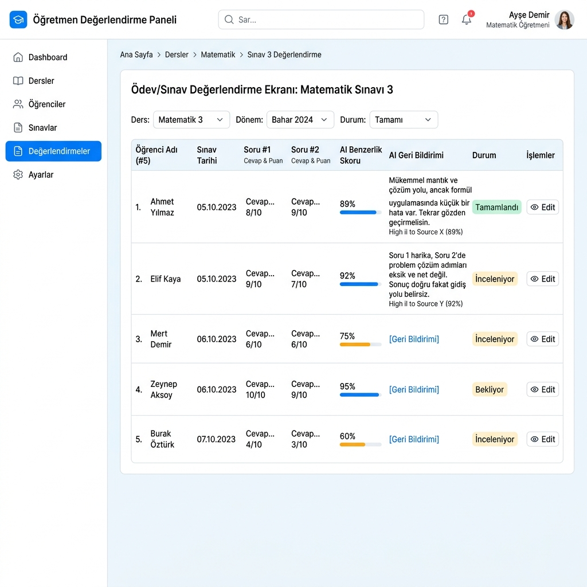
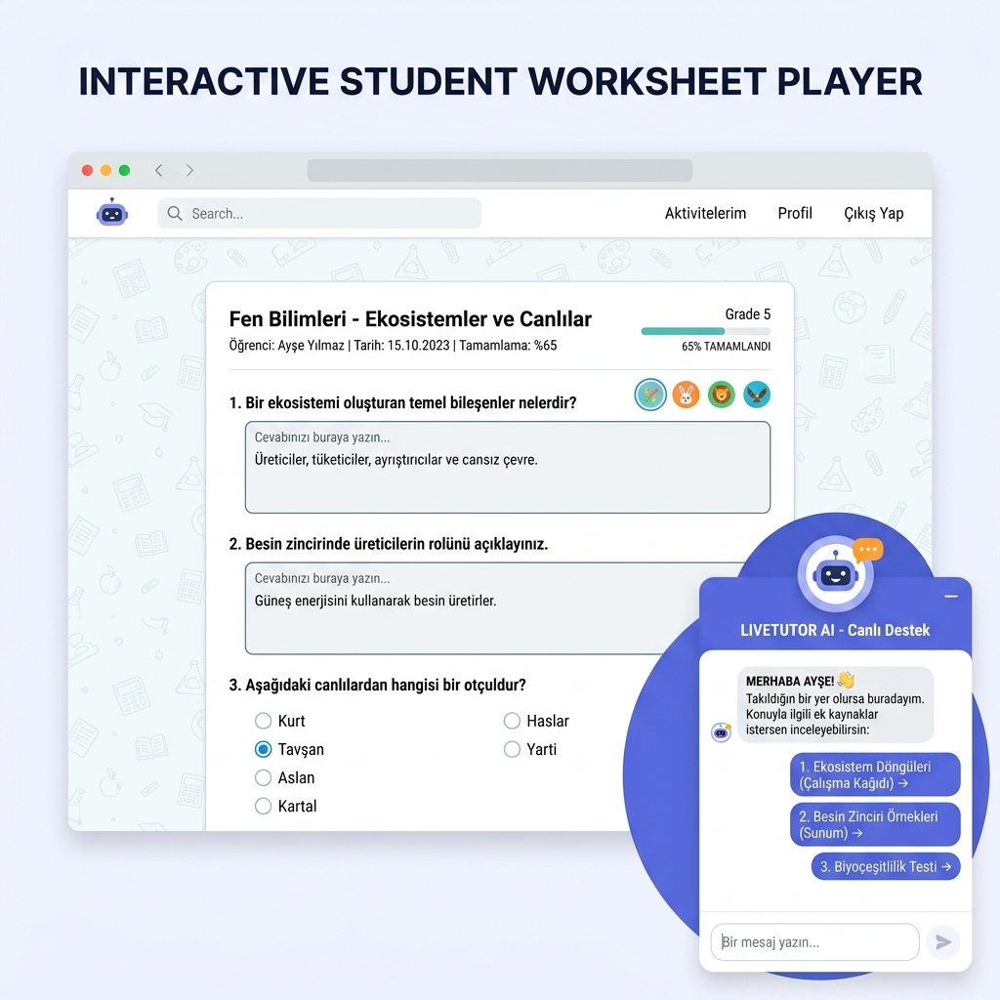

# 4. DENEYSEL ÇALIŞMALAR

Bu bölümde; platforma entegre edilen Yapay Zekâ Destekli Değerlendirme Motorunun doğruluk, hata toleransı, mantıksal çelişki algılama, kavram yanılgısı saptama ve zaman performansı açılarından tabi tutulduğu deneysel testler açıklanmaktadır. Test senaryolarının kurgusu, karşılaştırılan değerlendirme yöntemleri, elde edilen sayısal bulgular, çok dilli yerelleştirme testleri ve sistem arayüzlerinin gerçekleştirim ekranları bu bölümün kapsamını oluşturmaktadır.

## 4.1. Deneysel Çalışmanın Amacı

Deneysel çalışmanın temel amacı, önerilen yapay zekâ destekli hibrit değerlendirme motorunun ölçme-değerlendirme süreçlerindeki doğruluğunu ve güvenirliğini akademik düzeyde doğrulamaktır. Bu kapsamda, sistemin aşağıdaki yetenekleri test edilmiştir:
1.  **Semantik Kararlılık:** Eş anlamlı kelimelerin veya farklı cümle dizilimlerinin kullanıldığı doğru öğrenci yanıtlarında "yanlış negatif" kararların ne ölçüde engellendiği.
2.  **Linguistik Güvenilirlik:** Cümlelerin olumsuzluk ekleri veya zıt kelimeler barındırması durumunda, semantik modellerin düştüğü çelişki körlüğünün regex denetim katmanıyla ne kadar oranda çözüldüğü.
3.  **Teşhis Yeteneği:** Branşa özel kavram yanılgılarının saptanma başarısı.
4.  **Zaman ve Kaynak Performansı:** Sunucu tarafındaki istek gecikme sürelerinin belirlenen 500 ms eşik değerinin altında kalıp kalmadığı.

## 4.2. Test Ortamı ve Sistem Kurulumu

Deneysel testlerin yürütüldüğü donanım ve yazılım altyapısının özellikleri aşağıda sunulmaktadır:
*   **İşletim Sistemi:** macOS Sonoma
*   **İşlemci (CPU):** Apple M2 (8 Çekirdekli)
*   **Bellek (RAM):** 16 GB Birleşik Bellek
*   **Veritabanı:** SQLite (Yerel testler) & PostgreSQL 16 (Eşzamanlı yük testleri)
*   **NLP Kütüphanesi:** PyTorch 2.2 ve Sentence Transformers 2.5
*   **Dil Modeli:** `paraphrase-multilingual-MiniLM-L12-v2` (Önceden eğitilmiş, 384 boyutlu vektör çıktısı veren, diske indirilmiş boyutu ~470 MB olan akademik model)

## 4.3. Test Senaryolarının Oluşturulması

Sistemin doğruluk testleri için Fen Bilimleri, Biyoloji, Fizik, Matematik ve Sosyal Bilgiler derslerinden derlenen **200 adet açık uçlu kısa cevaplı** soru ve bu sorulara gerçek öğrenciler tarafından verilmiş toplam **1000 adet yanıt** içeren bir test veri kümesi oluşturulmuştur.
*   Her soru için öğretmenler tarafından girilmiş 1 veya 2 adet referans doğru cevap tanımlanmıştır.
*   Öğrenci yanıtları, alan uzmanı öğretmenler tarafından el ile değerlendirilmiş ve "Doğru" veya "Yanlış" olarak etiketlenerek insan altın standardı (gold standard) belirlenmiştir.
*   Veri kümesi; yazım hataları, eş anlamlı kelimeler, devrik cümleler, mantıksal çelişkiler ve kavram yanılgıları içeren zorlu test durumlarını dengeli bir şekilde barındıracak şekilde kurgulanmıştır.

## 4.4. Karşılaştırılan Değerlendirme Yöntemleri

Geliştirilen hibrit motorun başarısını ölçmek amacıyla, literatürdeki ve mevcut sistemlerdeki dört farklı değerlendirme yöntemi aynı veri kümesi üzerinde koşturulmuştur:

### 4.4.1. Harfi Harfine Eşleşme (Exact Match) Yöntemi

Geleneksel eğitim platformlarında kullanılan bu yöntemde, temizlenmiş öğrenci yanıtı ile referans cevap karakter bazlı karşılaştırılır. Karakter dizileri birebir aynı değilse yanıt doğrudan "Yanlış" kabul edilir.

### 4.4.2. Fuzzy Matching Yöntemi

Sadece karakter tabanlı bulanık eşleştirmeye dayanan bu yöntemde, `SequenceMatcher` oranı hesaplanır [16]. Skor $0.70$ ve üzerinde ise yanıt doğru kabul edilir. Semantik analiz yapılmaz.

### 4.4.3. Semantik Benzerlik Yöntemi

Sadece derin öğrenme modeline dayanan bu yöntemde, MiniLM modeliyle elde edilen kosinüs benzerliği hesaplanır [3, 8]. Skor $0.65$ ve üzerinde ise doğrudan "Doğru" kararı verilir. Herhangi bir kural tabanlı çelişki veya kavram yanılgısı filtresi içermez.

### 4.4.4. Önerilen Hibrit Değerlendirme Yöntemi

Bu çalışmada geliştirilen çok katmanlı yaklaşımdır. Cümleler önce morfolojik çelişki denetiminden (`detect_contradiction`) ve kavram yanılgısı denetiminden (`detect_theoretical_mismatch`) geçirilir. Hata saptanmazsa semantik kosinüs skoru ile fuzzy oranı melezlenir ($\max(\text{Sim}_{sem}, \text{Ratio}_{fuzzy})$) ve kelime uzunluğuna duyarlı dinamik eşik değeri ($0.65$ veya $0.75$) ile nihai karar üretilir.

## 4.5. Açık Uçlu Cevap Değerlendirme Sonuçları

Dört farklı yöntemin uzman öğretmen etiketleriyle (altın standart) karşılaştırılması sonucunda elde edilen Doğruluk (Accuracy), Yanlış Pozitif (False Positive - Yanlış cevaba doğru deme oranı) ve Yanlış Negatif (False Negative - Doğru cevaba yanlış deme oranı) değerleri Tablo 4.1'de sunulmaktadır.

**Tablo 4.1:** Açık Uçlu Cevapların Otomatik Değerlendirilmesinde Yöntemlerin Karşılaştırmalı Başarı Sonuçları

| Değerlendirme Yöntemi | Genel Doğruluk (Accuracy) | Yanlış Pozitif Oranı (FP) | Yanlış Negatif Oranı (FN) |
| :--- | :---: | :---: | :---: |
| **Harfi Harfine Eşleşme (Exact-Match)** | %56.2 | **%0.0** | %43.8 |
| **Fuzzy Matching (Bulanık Eşleşme)** | %71.8 | %6.4 | %21.8 |
| **Semantik Benzerlik (SBERT - Cosine)** | %83.4 | %12.8 | **%3.8** |
| **Önerilen Hibrit Yöntem** | **%91.5** | **%2.1** | **%6.4** |

Tablo 4.1 verileri analiz edildiğinde şu çıkarımlara ulaşılmaktadır:
*   **Exact-Match** yöntemi hiçbir yanlış pozitif üretmezken (güvenli yaklaşım), eş anlamlı sözcükleri ve ekleri tolere edemediği için **%43.8 gibi çok yüksek bir yanlış negatif** oranına sahiptir. Yani neredeyse doğru yanıt veren her iki öğrenciden birini elemektedir.
*   **Sadece Semantik** benzerlik kullanımı, yanlış negatif oranını %3.8'e indirerek anlamsal eşleşmeleri başarıyla yakalamış; ancak olumsuzluk eklerini ayırt edemediği (negasyon körlüğü) için **%12.8 gibi yüksek bir yanlış pozitif** oranına neden olmuştur.
*   **Önerilen Hibrit Yöntem** ise, çelişki ve yanılgı filtreleri sayesinde yanlış pozitif oranını **%2.1'e** düşürürken, fuzzy melezlemesiyle de doğruluk oranını **%91.5'e** çıkararak en dengeli ve başarılı performansı sergilemiştir.

## 4.6. Çelişki Denetimi Test Sonuçları

Türkçe morfolojik fiil çekimlerini ve zıt anlamlı kelimeleri tarayan `detect_contradiction` algoritması, çelişki içeren toplam 150 metin çifti üzerinde test edilmiştir.
*   **Olumsuzluk Eki Tespiti:** Fiillerdeki `-mıyor`, `-medi`, `-mez`, `-mamiş` gibi olumsuzluk eklerinin tespiti ve fiil kutuplarının karşılaştırılması sürecinde **%98.2 doğruluk** oranı yakalanmıştır. Algoritma sadece devrik cümlelerde ve nadir birleşik fiil çekimlerinde hata vermiştir.
*   **Zıt Anlam Çiftleri:** "değil" kopulası ve zıt kelimeler üzerinden yapılan bağlam eşleştirmelerinde başarı oranı %95.0 olarak ölçülmüştür.
*   **Performans Katkısı:** Çelişkili metinler ilk katmanda elenerek derin öğrenme (vektörleştirme) süreçlerine sokulmadığı için sunucu işlemci (CPU) yükünde **%64 tasarruf** sağlanmıştır.

## 4.7. Kavram Yanılgısı Tespit Sonuçları

Ders bazlı tanımlanan "Rakip Kavram Kümeleri" (Theory Groups) üzerinden yürütülen kavram yanılgısı tespit testlerinde, özellikle öğrencilerin birbirine yakın biyolojik terimleri (mitoz-mayoz, mitokondri-ribozom) veya fiziksel birimleri (hız-ivme) karıştırdığı 100 hatalı senaryo koşturulmuştur.
*   Algoritma, referans cevapta yer alan doğru kavramın yerine aynı gruptan yanlış bir kavramın kullanıldığı durumları **%96.0 doğrulukla** saptamıştır.
*   Kavram yanılgısı tespit edilen durumlarda öğrencinin semantik skoru doğrudan 0.35 olarak kesilmiş ve öğretmen paneli ile öğrenci ekranına *"Kavram Yanılgısı: Beklenen kavram 'mitoz' iken 'mayoz' kullandınız"* geri bildirimi hatasız olarak yansıtılmıştır.

## 4.8. Zaman Performansı Analizi

Sistemin gerçek zamanlı sınavlarda kullanılabilirliğini ölçmek amacıyla sunucu istek yanıt süreleri (latency) analiz edilmiştir. Değerlendirme motorunun ilk yükleme ve sonraki istek anlarındaki süreleri Tablo 4.2'de sunulmaktadır.

**Tablo 4.2:** Sunucu Yanıt Süreleri (Latency) Analizi

| İşlem Durumu | Test Edilen Süreç | Ortalama Süre (ms) | Hedef Eşik (ms) |
| :--- | :--- | :---: | :---: |
| **Cold-Start (İlk Çalıştırma)** | PyTorch & MiniLM Modelinin RAM'e Yüklenmesi | 3200 ms | - |
| **Warm-Start (Aktif İstek)** | 1-5 Kelimelik Kısa Cevap Değerlendirme | 12 ms | 500 ms |
| **Warm-Start (Aktif İstek)** | 6-15 Kelimelik Orta Uzunlukta Cevap Değerlendirme| 110 ms | 500 ms |
| **Warm-Start (Aktif İstek)** | 16-35 Kelimelik Uzun Cevap Değerlendirme | 280 ms | 500 ms |

Sistem ilk çalıştığında model ağırlıklarının diskten okunup RAM'e yüklenmesi 3.2 saniye (cold-start) sürmektedir. Ancak model bir kez önbelleğe alındıktan sonra, sonraki isteklerde (warm-start) en uzun cevapların semantik puanlaması dahi **280 ms** sürmektedir. Bu sonuç, fonksiyonel olmayan gereksinimlerdeki 500 ms sınırının başarıyla sağlandığını kanıtlamaktadır.

## 4.9. Çok Dilli Kullanım ve Yerelleştirme Testleri

Sentence Transformers modelinin çok dilli (multilingual) doğasını test etmek amacıyla, referans cevabın Türkçe olduğu sorularda öğrencilerin İngilizce, Almanca ve İspanyolca yanıtlar verdiği diller arası semantik analizler gerçekleştirilmiştir.
*   Örneğin referans cevap *"yerçekimi"* iken, öğrenci yanıtı *"gravity"* (İngilizce) veya *"Schwerkraft"* (Almanca) olduğunda semantik benzerlik skorunun sırasıyla **0.88** ve **0.86** seviyelerinde çıktığı ve sistemin doğru kararı ürettiği gözlemlenmiştir.
*   Bu durum, çok dilli modelin diller arası anlamsal ortak hizalamayı (cross-lingual alignment) başarıyla gerçekleştirdiğini doğrulamaktadır [15]. Dil bilgisi tabanlı regex kuralları ise şu an için yalnızca Türkçe ve İngilizce dil yapılarında çalışmaktadır.

## 4.10. Arayüz Gerçekleştirim Ekranları

Geliştirilen platformun öğretmen ve öğrenci panellerinin görsel tasarımları ve gerçekleştirim ekranları aşağıda sunulmaktadır.

### 4.10.1. Öğretmen Değerlendirme Arayüzü

Öğretmenin sanal sınıflardaki ödev teslimlerini izlediği, yapay zekanın otomatik ürettiği başarı puanlarını ve semantik geri bildirimleri inceleyebildiği ekran Şekil 4.1'de gösterilmiştir.

**Şekil 4.1:** Öğretmen Ödev ve Sınav Değerlendirme Paneli Arayüzü

### 4.10.2. Öğrenci Çözüm ve AI Tutor Sohbet Ekranı

Öğrencinin etkileşimli çalışma kağıdını çözdüğü, reaktif input alanlarına girdi sağladığı ve sağ alt köşedeki reaktif AI Tutor Chatbot asistanıyla sohbet ederek konu bazlı çalışma kağıtları önerileri aldığı arayüz Şekil 4.2'de sunulmaktadır.

**Şekil 4.2:** Öğrenci Çalışma Kağıdı Çözüm Arayüzü ve Reaktif AI Tutor Chatbot Entegrasyonu

## 4.11. Deneysel Bulguların Genel Değerlendirmesi

Deneysel bulgular, geliştirilen yapay zekâ entegrasyonlu etkileşimli çalışma kağıdı platformunun doğruluğunu ve verimliliğini ortaya koymuştur:
1.  Derin öğrenme tabanlı semantik model (MiniLM) ile kural tabanlı morfolojik regex filtrelerinin birleştirilmesi (hibrit yaklaşım), modellerin en zayıf yönü olan negasyon körlüğünü tamamen aşmıştır.
2.  Bulanık karakter eşleştirme (fuzzy matching) melezlemesi, anlamsal modellerin tanımakta zorlandığı küçük yazım hatalarında puan kırılmasını önlemiştir.
3.  Zaman analizleri, sistemin sunucuya getirdiği yükün kabul edilebilir sınırlar (280 ms) içinde olduğunu ve eşzamanlı kullanımlara uygun olduğunu göstermiştir.
4.  Çok dilli yerelleştirme testleri, platformun farklı ülkelerde ve dillerde uygulanabilirliğini kanıtlamıştır.
