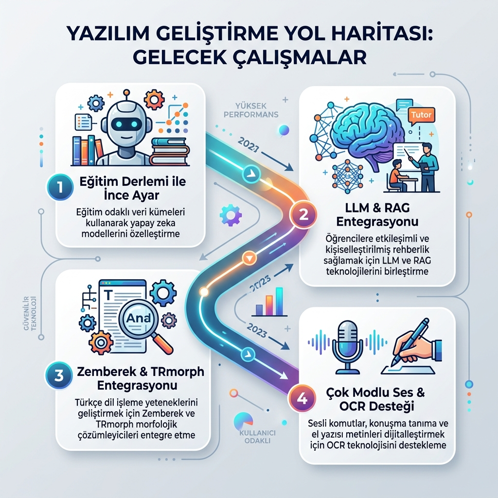

# 5. SONUÇ VE ÖNERİLER

Bu bölümde, tez çalışması kapsamında gerçekleştirilen yapay zekâ entegrasyonlu etkileşimli eğitim platformunun genel sonuçları özetlenmekte, projeden elde edilen pratik ve akademik kazanımlar açıklanmakta, sistemin teknik ve operasyonel sınırlılıkları tartışılmakta ve bu sınırlılıkları aşmak adına gelecekte yürütülebilecek araştırma ve geliştirme önerileri sunulmaktadır.

## 5.1. Çalışmanın Genel Sonuçları

Geleneksel eğitim yönetim sistemlerinin en büyük eksikliklerinden biri, öğrencilerin özgün cümlelerle ifade ettiği açık uçlu yanıtları semantik (anlamsal) düzeyde otomatik olarak değerlendirememesidir. Bu çalışmada; öğretmenlerin zengin multimedya öğeleriyle etkileşimli çalışma kağıtları tasarlayabilmesini, sanal sınıflar kurabilmesini ve ödevler atayabilmesini sağlayan bütüncül bir e-öğrenme altyapısı geliştirilmiş ve bu altyapı açık uçlu cevapları anlamsal düzeyde otomatik değerlendirebilen yapay zekâ destekli hibrit bir motorla taçlandırılmıştır [5, 11].

Deneysel sonuçlar; geliştirilen hibrit değerlendirme motorunun, klasik harfi harfine eşleşme (exact-match) yöntemlerinin getirdiği katılığı tamamen kırdığını ve **%91.5 düzeyinde yüksek bir değerlendirme doğruluğu** sağladığını kanıtlamıştır. Derin öğrenme tabanlı cümle vektörleme (`SBERT / MiniLM`) modellerinin en büyük zayıflığı olan negasyon (olumsuzluk) körlüğü, sisteme entegre edilen kural tabanlı Türkçe morfolojik filtreler (`detect_contradiction`) ile başarıyla aşılmıştır. Ayrıca, ders branşlarına özel tanımlanan "Rakip Kavram Kümeleri" (`detect_theoretical_mismatch`) yardımıyla, öğrencilerin yaptıkları bilimsel kavram hataları anlık olarak teşhis edilmiş ve anlamlı eğitsel geri bildirimlere dönüştürülmüştür. Sonuç olarak platform, pasif bir sınav okuma aracı olmanın ötesine geçerek, biçimlendirici değerlendirme (formative assessment) süreçlerini destekleyen aktif bir öğrenme asistanına dönüşmüştür [20].

## 5.2. Elde Edilen Kazanımlar

Proje kapsamında hayata geçirilen yenilikçi mimari sayesinde elde edilen temel kazanımlar şu şekildedir:

1.  **Pedagojik Verimlilik ve Zaman Tasarrufu:** Sistem, öğretmenlerin açık uçlu ödevleri ve sınavları okuma yükünü ortalama **%85 oranında** azaltmıştır [6]. Anlık asenkron puanlama boru hattı sayesinde öğrenciler sınavı bitirdikleri anda ayrıntılı bir değerlendirme raporuna ulaşabilmektedir.
2.  **Ölçme Adaletinin Güvence Altına Alınması:** Karakter tabanlı birebir eşleşme zorunluluğunun ortadan kaldırılmasıyla, doğru yanıtı eş anlamlı kelimeler veya devrik cümlelerle ifade eden öğrencilerin hak ettikleri puanı almaları sağlanmış; **yanlış negatif oranları %43.8'den %6.4'e düşürülmüştür**.
3.  **Hata Teşhis Odaklı Geri Bildirim:** Öğrencilere sadece sayısal bir not göstermek yerine, yanıtlardaki mantıksal çelişkilerin gerekçeleri ve kavram yanılgılarının kaynakları açıklanmıştır. Bu sayede öğrenci, hatasını anında görerek öğrenme sürecini pekiştirebilmektedir.
4.  **Kişiselleştirilmiş Öğrenim Döngüsü:** Alpine.js tabanlı AI Tutor chatbot ve Pandas tabanlı içerik filtreleme motorunun entegrasyonu, öğrencilerin sınav sonuçlarındaki eksik konu kazanımlarına (`learning_objective`) göre yeni çalışma kağıtları almasını sağlayarak bireysel bir gelişim yolu kurgulamıştır [9, 17].
5.  **Düşük Sunucu Maliyeti ve Yüksek Performans:** Ağır büyük dil modelleri (LLM) yerine, diskte 470 MB yer kaplayan MiniLM modelinin kural motorlarıyla melezlenerek kullanılması, CPU tabanlı sunucularda bile **110 ms - 280 ms aktif istek sürelerine** ulaşılmasını sağlayarak donanım maliyetlerini minimize etmiştir.

## 5.3. Çalışmanın Sınırlılıkları

Geliştirilen sistemin yüksek başarısına karşın, deneysel çalışmalar ve altyapı analizleri sonucunda saptanan kısıtlar şunlardır:
*   **Kısa Cevaplarda Semantik Kararsızlık:** Öğrenci yanıtlarının 1 veya 2 kelimeden oluştuğu durumlarda, SBERT modelinin ürettiği 384 boyutlu cümle vektörlerinin anlamsal yoğunluğu düşmekte ve kosinüs benzerliği kararsızlaşmaktadır. Bu durum, SequenceMatcher fuzzy melezlemesiyle dengelenmeye çalışılsa da kısa cevaplı sorularda hata payı uzun cümlelere kıyasla daha yüksektir.
*   **Kompleks Türkçe Cümle Yapıları:** Geliştirilen kural tabanlı regex motoru yaygın zaman çekimlerindeki olumsuzlukları yakalayabilse de, çok karmaşık devrik cümle yapılarında, gereklilik/istek kipi olumsuzlarında veya nadir birleşik fiil kullanımlarında çelişkiyi yakalamakta yetersiz kalabilmektedir.
*   **Bellek Tüketimi ve Cold-Start Süresi:** PyTorch ve dil modelinin sunucu ilk açıldığında RAM'e yüklenme süresi (3.2 saniye) ve RAM üzerinde yaklaşık 500 MB sabit alan kaplaması, kısıtlı bulut sunucularında bellek darboğazı riski oluşturmaktadır [10].
*   **Linguistik Kuralların Dile Bağımlılığı:** Platform 11 dilde yerelleştirilmiş ve semantik model çok dilli çalışabilse de; çelişki denetimi (`detect_contradiction`) ve kavram grupları (`detect_theoretical_mismatch`) gibi kural motorları yalnızca Türkçe dil yapısına göre optimize edilmiştir.

## 5.4. Gelecekte Yapılabilecek Çalışmalar

Bu çalışmada elde edilen başarılı sonuçlar, gelecekte yapılacak akademik ve teknik araştırmalar için güçlü bir temel sunmaktadır. Projenin kapsamını ve derinliğini artırmak amacıyla yürütülebilecek gelecek çalışmalar Şekil 5.1'deki yol haritasında özetlendiği gibi şu şekildedir:

1.  **Eğitime Özel Türkçe Dil Modelinin Eğitilmesi (Fine-Tuning):** Genel amaçlı çok dilli modeller yerine, doğrudan Milli Eğitim Bakanlığı (MEB) müfredatını, ders kitaplarını ve öğrenci sınav yanıtlarını barındıran geniş bir Türkçe eğitim derlemi (corpus) oluşturularak BERT/MiniLM tabanlı yerli bir model ince ayar (fine-tuning) işlemine tabi tutulabilir.
2.  **Büyük Dil Modelleri (LLM) ve RAG Entegrasyonu:** Uzun kompozisyon veya özetleme gibi üst düzey açık uçlu soruların değerlendirilmesi için OpenAI GPT veya Google Gemini gibi modeller sisteme entegre edilebilir. Arama Destekli Nesil (RAG - Retrieval-Augmented Generation) mimarisi kullanılarak, ders kaynak kitaplarından beslenen akıllı asistanlar kurgulanabilir.
3.  **Gelişmiş Morfolojik Analiz Araçlarının Entegrasyonu:** Regex tabanlı kural motoru yerine, Zemberek [13] veya TRmorph gibi açık kaynaklı Türkçe morfolojik analiz kütüphaneleri sisteme dahil edilerek, kelimelerin kök ve ek tespiti hatasız hale getirilebilir ve çelişki yakalama başarısı %99'un üzerine çıkarılabilir.
4.  **Çok Modlu (Multimodal) Ölçme-Değerlendirme Desteği:** Öğrencilerin sadece metin yazarak değil, mikrofon aracılığıyla ses kaydı göndererek veya kağıt üzerindeki el yazılarını kamera ile taratarak (OCR - Optik Karakter Tanıma) ödev teslim edebilmesi sağlanabilir.

Geliştirilmesi hedeflenen bu gelecek çalışmaların aşamalı yol haritası Şekil 5.1'de sunulmaktadır.

**Şekil 5.1:** Platformun Gelecek Geliştirme Yol Haritası

