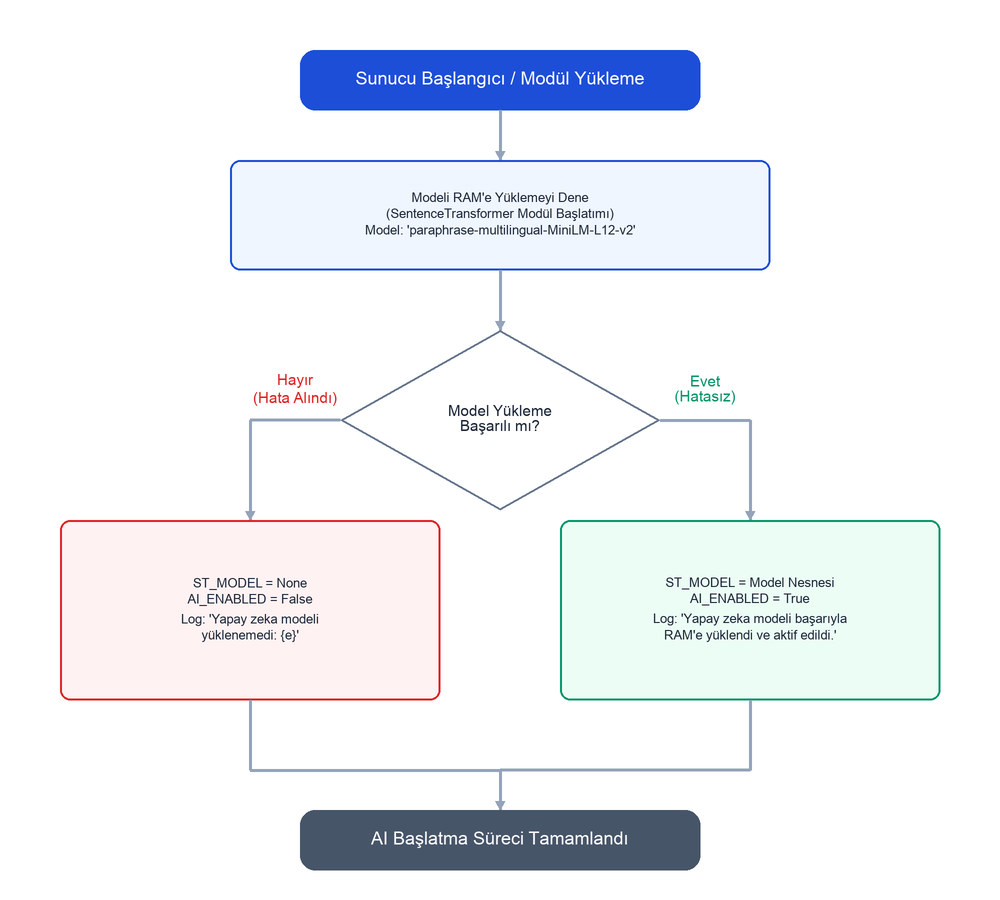
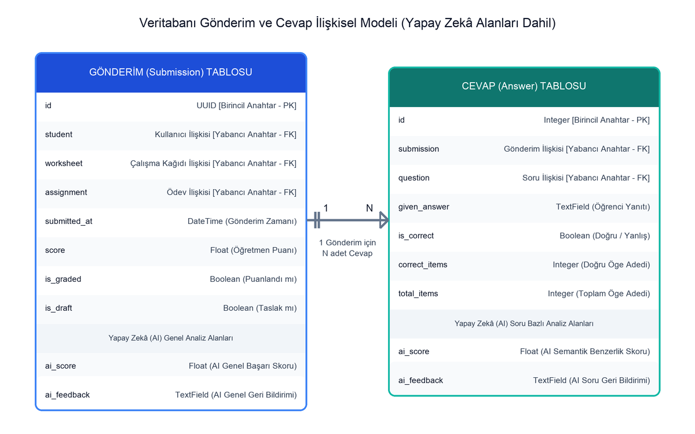
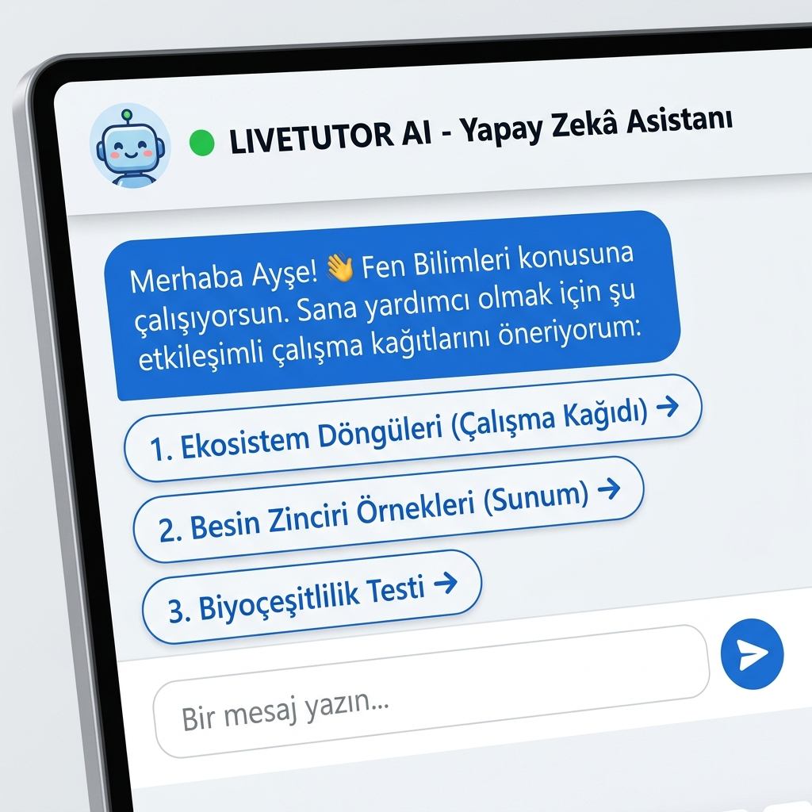

# EKLER

## Ek-1. Yapay Zekâ Modülü Model Başlatma ve Sistem Konfigürasyonu

Aşağıdaki akış şeması, `apps/submissions/ai_engine.py` dosyası içerisindeki Sentence Transformers modelinin sunucu başlangıcında RAM'e yüklenmesi ve AI çalışma durumu kontrol mekanizmasını göstermektedir:

---

## Ek-2. Veritabanı Modelleri İlişkisel Yapısı

Aşağıdaki ilişkisel model şeması, `apps/submissions/models.py` dosyasındaki yapay zekâ değerlendirme çıktılarını ve puanlarını saklamak üzere kurgulanan `Submission` (Gönderim) ve `Answer` (Cevap) modellerinin alan tanımlarını ve aralarındaki bire çok (1:N) ilişkiyi göstermektedir:

---

## Ek-3. AI Tutor Chatbot Arayüzü

Aşağıdaki kullanıcı arayüzü görseli, öğrencilerin çalışma kağıtlarını çözerken veya konu çalışırken takıldıkları yerlerde yapay zekâ asistanından yardım almalarını sağlayan, konu ve seviye bazlı dinamik materyal önerileri sunan AI Tutor Chatbot arayüzünü göstermektedir:

---

## Ek-4. Ek Ekran Görüntüleri

Tez çalışması kapsamında tasarlanan platformun mimari, veritabanı, akış ve arayüz yapılarının görsel haritası aşağıda listelenmiştir. İlgili dosyalar proje klasöründeki `tez/gorseller/` dizini altında yer almaktadır:

1.  **Şekil 3.1 (Genel Sistem Mimarisi):** `gorseller/system_architecture.png`
2.  **Şekil 3.2 (Varlık-İlişki Diyagramı):** `gorseller/database_er_diagram.png`
3.  **Şekil 3.3 (Yapay Zekâ Değerlendirme Akış Şeması):** `gorseller/evaluation_flowchart.png`
4.  **Şekil 4.1 (Öğretmen Değerlendirme Arayüzü):** `gorseller/teacher_dashboard.png`
5.  **Şekil 4.2 (Öğrenci Çözüm ve AI Tutor Chatbot Arayüzü):** `gorseller/student_player.png`
6.  **Şekil 5.1 (Gelecek Çalışmalar Yol Haritası):** `gorseller/future_work_roadmap_tr.png`

---

## Ek-5. Test Senaryoları ve Örnek Cevaplar

Açık uçlu soru değerlendirme motorunun çelişki denetimi, kavram yanılgısı saptama ve hibrit semantik puanlama yeteneklerini test etmekte kullanılan örnek senaryolar Tablo E5.1'de sunulmaktadır.

**Tablo E5.1:** AI Değerlendirme Motoru Örnek Test Senaryoları ve Karar Analizleri

| Ders / Branş | Referans Doğru Cevap | Öğrenci Yanıtı | Hesaplanan AI Skoru | Verilen AI Kararı | Tetiklenen AI Katmanı / Geri Bildirim |
| :--- | :--- | :--- | :---: | :---: | :--- |
| **Biyoloji** | Mitokondri hücrede ATP sentezini gerçekleştirir. | Enerji üretimi mitokondri organelinde gerçekleşmektedir. | 0.88 | **Doğru** | *Semantik Eşleşme:* Cümlenin anlamı beklenen bağlamla örtüşüyor. |
| **Biyoloji** | Mitokondri hücrede ATP sentezini gerçekleştirir. | Mitokondri ATP sentezini **gerçekleştirmez**. | 0.30 | **Yanlış** | *Çelişki Denetimi:* Fiil olumsuzluk çelişkisi saptandı. |
| **Biyoloji** | Hücrenin enerji santrali mitokondridir. | Hücrede protein sentezini yapan organel ribozomdur. | 0.35 | **Yanlış** | *Kavram Yanılgısı:* Beklenen kavram 'mitokondri' iken 'ribozom' kullandınız. |
| **Fizik** | Net kuvvet sıfır ise cisim eylemsizliğini korur. | Cismin üzerine etki eden net kuvvet sıfırsa cisim durmaya veya sabit hızlı gitmeye devam eder. | 0.84 | **Doğru** | *Semantik Eşleşme:* Semantik olarak doğru kabul edildi. |
| **Kimya** | Asitler turnusol kağıdını kırmızıya boyar. | Asitler turnusolu **maviye** boyar. | 0.30 | **Yanlış** | *Çelişki Denetimi:* Zıt anlam çelişkisi ('kırmızı' ve 'mavi' zıt bağlamlarda). |

---

# ÖZGEÇMİŞ

### Ali DÖNMEZ
**Eğitim Bilgileri:**
*   **Lisans:** Gazi Üniversitesi, Teknoloji Fakültesi, Bilgisayar Mühendisliği Bölümü (2022 - 2026)
*   **Lise:** Ankara Atatürk Anadolu Lisesi (2018 - 2022)

**Çalışma Alanları:**
*   Yapay Zekâ ve Doğal Dil İşleme (NLP)
*   Web Teknolojileri ve Sunucu Yönetimi
*   Eğitim Teknolojileri (EdTech)

---

### İsmail DÜNDAR
**Eğitim Bilgileri:**
*   **Lisans:** Gazi Üniversitesi, Teknoloji Fakültesi, Bilgisayar Mühendisliği Bölümü (2022 - 2026)
*   **Lise:** Ankara Gazi Anadolu Lisesi (2018 - 2022)

**Çalışma Alanları:**
*   Yapay Öğrenme ve Derin Öğrenme Modelleri
*   Ön Yüz Geliştirme (Frontend) ve Kullanıcı Deneyimi (UX)
*   Veri Analitiği ve Algoritma Tasarımı
